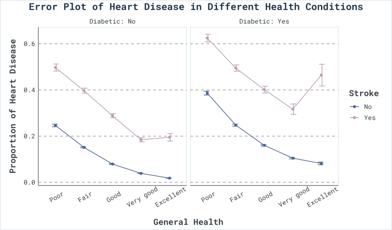
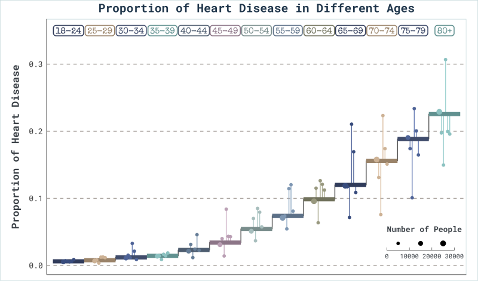
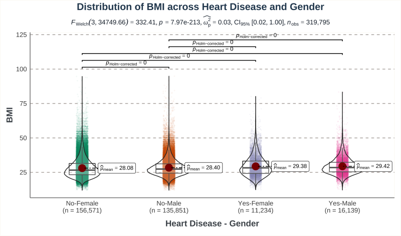
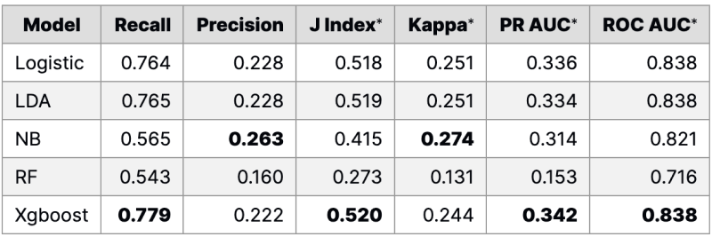
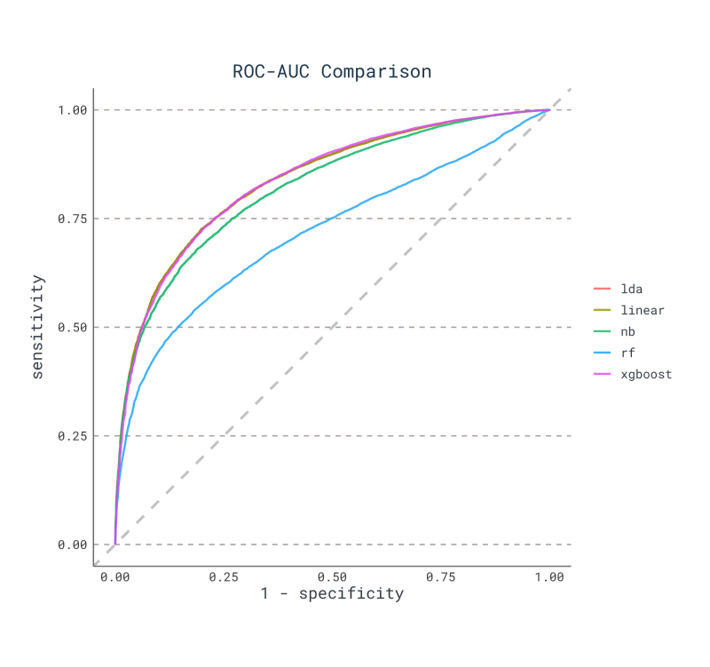
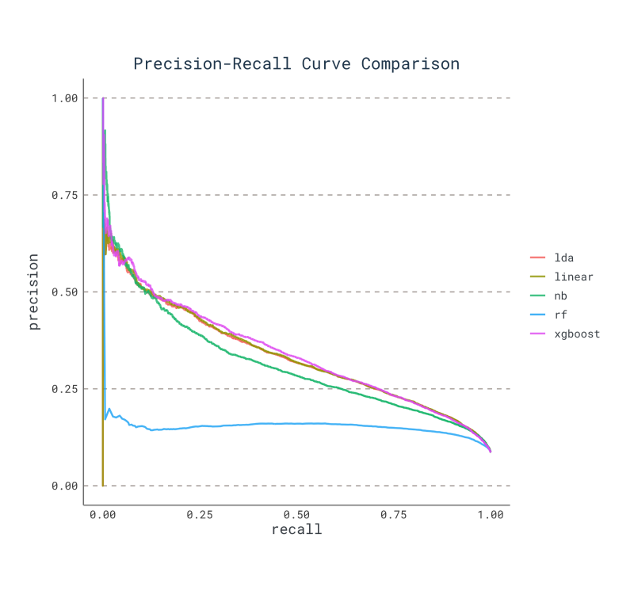
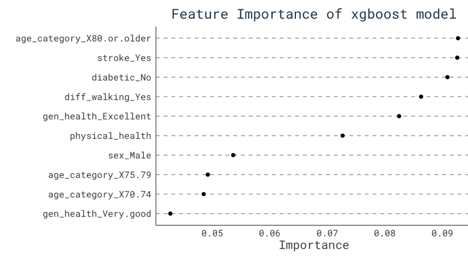

[🔗GitHub repo](https://github.com/CeleritasML/heart-disease-prediction) 

## Abstract

In 2020, the U.S. Center for Disease Control (CDC) compiled a 319,795-by-18 tabular dataset for heart disease prediction. Treating the boolean-valued column “heart_disease” as the dependent variable and all other columns as predictor variables, the best initial screening model is picked among five candidate machine learning (ML) models. Initial screening particularly requires high recall so as not to miss any true positives. The training and test results reveal that gradient-boosted tree is the best model for this purpose, achieving a high recall rate of 78.5%.

## Introduction

According to the CDC, heart disease is a leading natural cause of death in the U.S. Finding important indicators for heart disease is an ongoing valuable inquiry in the medical community. Highly flexible models with low interpretability such as a deep neural network are avoided for this reason. Decision tree-based models, namely a gradient-boosted tree and a random forest are chosen both for the ease of interpreting the relative importance of input features and their robustness in learning complex data patterns. Other methods based on the maximum likelihood principle such as a naive Bayes classifier, logistic regression and linear discriminant analysis (LDA) are also implemented to compare model performance based on a different approach from tree-based models. In the order of importance, the metrics used for evaluating model effectiveness include recall, area under the receiver operating characteristic curve (AUC-ROC), precision, and accuracy.

## Dataset and EDA

- **Dataset**: Originally, the dataset comes from the CDC and is a major part of the Behavioral Risk Factor Surveillance System (BRFSS), which conducts annual telephone surveys to gather data on the health status of U.S. residents. It contains 18 variables including age, gender, BMI, etc., revealing most of the essential information of heart diseases.
- **Dataset bias**: Over 90% of respondents in the dataset do not have heart disease. Therefore a hypothetical null model that guesses “No” for every single row will achieve a high accuracy score of 90% despite learning nothing about the data. Extensive data engineering techniques were used to counter this bias at training time to produce the desired model (see Models section).
- **EDA**: 
    - Respondents who suffer from diabetics and stroke, or have a relatively poor general health condition are more likely to have heart diseases.
    - As a respondent’s age increases, the probability of having heart disease so tends to ascend.
    - It is statistically significant that the average BMI of men is higher than that of women, and a higher BMI is associated with a higher risk for heart disease.

## Models

The original dataset is split into 80%-20% train-test subsets. Furthermore, an additional 10-fold cross-validation is carried out for the training set. All splitting is stratified on response. 

The five candidate models in this project are:

- **baseline models: {logitic regression, LDA, naïve Bayes}**
- **tree models: {random forest, XGBoost}**

To overcome the class imbalance in the training set, for baseline models, a ROSE (Random Over-Sampling Examples) is used in favor of the underrepresented positive samples. For tree models, the class imbalance is countered by tuning the class weights higher in favor of positive samples.

For each tree-based model, hyperparameter tuning was achieved by exploring a large grid of hyperparameter combinations, and then the final model is selected based on the best (highest) ROC-AUC value. After obtaining the optimal hyperparameters, the test dataset is used to check for overfitting. Finally, metrics such as recall, AUC-ROC, precision, and accuracy are used for evaluation.

## Results

Since the goal of these models is to detect potential heart disease in the early stage, an essential priority is to keep a **low false-negative rate**. Therefore, **instead of accuracy**, special classification metrics such as recall, J-index, and ROC-AUC are of greater importance and are included in Table 1 to the right.

> *J index: Youden's J statistic, Kappa: Cohen's kappa coefficient, PR AUC: area under the precision-recall curve, ROC AUC: area under the ROC curve

**Logistic regression, LDA, and XGBoost are the best models** in terms of overall performance. **XGBoost model has the highest recall, J index, and PR-AUC**. By examining ROC and PRC for each of five models, one can also conclude that the XGBoost model is indeed the best option in general.

Additionally, relative feature importance in logistic regression and XGBoost are analyzed to determine whether a factor is related to heart disease. The most relevant variables are listed below (in descending order of importance, **positive**/_negative_):

**greater than 70 years old** | **stroke** | _good general health_ | _less than 45 years old_ | **difficult walking** | **smoking more than 100 cigarettes in entire life** | **diabetic** | **asthma** | _heavily alcohol drinking*_ | _regular exercise_

> *may not be true due to data bias.

## Conclusion

Key takeaways of this study can be summarized as follows:

1. All five models agree that **age, general health status, and pre-existing conditions are key risk indicators for heart disease**.
2. Features that are easily obtainable and do not need a hospital visit such as age, fitness level, BMI can be used to train robust ML models to identify people with high risk of heart disease. **A practical application can be deployed using the XGBoost model to notify a user through their health app when their health status indicates high risks for heart disease and recommend a hospital visit for an accurate diagnosis**. 
3. With a training dataset that under-represents positive cases, **low false-positive vs low false-negative rate is a trade-off**. Because keeping the false negative rate low is a priority, slightly sacrificing accuracy in favor of a lower false-negative rate is a necessary compromise. This is also why these screening models cannot replace medical imaging and clinical laboratory tests for heart disease diagnosis. **Screening isn’t diagnosis**.
